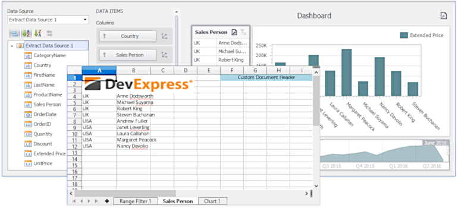

<!-- default badges list -->

<!-- default badges end -->

# BI Dashboard for WinForms - How to Add Custom Information to the Exported Excel Document

The [DashboardDesigner.CustomizeExportDocument](https://docs.devexpress.com/Dashboard/DevExpress.DashboardWin.DashboardDesigner.CustomizeExportDocument) event allows you to obtain the exported document's stream (the [e.Stream](https://docs.devexpress.com/Dashboard/DevExpress.DashboardCommon.CustomizeExportDocumentEventArgs.Stream) property) and change the document's layout.

In this example, the [Workbook](https://docs.devexpress.com/OfficeFileAPI/DevExpress.Spreadsheet.Workbook) component loads the [Excel document](https://docs.devexpress.com/Dashboard/15181) for further processing. The resulting document includes a custom header and highlighted text.

## Files to Review

* [Form1.cs](./CS/CustomExportDocumentExample/Form1.cs) (VB: [Form1.vb](./VB/CustomExportDocumentExample/Form1.vb))

## Documentation

- [Printing and Exporting](https://docs.devexpress.com/Dashboard/15181/common-features/printing-and-exporting)
- [Printing and Exporting (WinForms Designer)](https://docs.devexpress.com/Dashboard/15187)

## More Examples
- [Dashboard for WinForms - How to add custom information to the exported dashboard](https://github.com/DevExpress-Examples/winforms-dashboard-how-to-add-custom-information-to-the-exported-dashboard-t466558)
<!-- feedback -->
## Does this example address your development requirements/objectives?

 

(you will be redirected to DevExpress.com to submit your response)
<!-- feedback end -->
